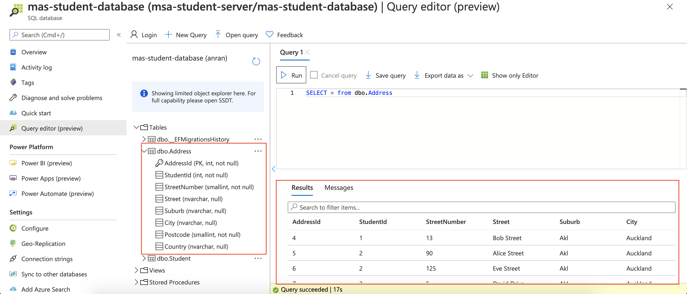

# MSA Phase 2020/Phase 1 - Databases and API

> Authored by Anran Niu on 16 July 2020

http://student-api-anran.azurewebsites.net/

## Database Tables

Two database tables are created by migrating from [Student](./StudentSIMS/Models/Student.cs) and [Address](/StudentSIMS/Models/Address.cs) models with EntityFrameworkCore.

### Student Table

### Address Table

## API

[StudentController](./StudentSIMS/Controllers/StudentsController.cs) and [AddressController](./StudentSIMS/Controllers/AddressesController.cs) are responsible for the APIs to conduct CRUD operations on Student and Address. The api methods for adding and changing address through student id are also added to [AddressController](./StudentSIMS/Controllers/AddressesController.cs).

### Student API

### Address API

## Learning Modules

The required microsoft learn modules have been completed - see [My Microsoft Profile - Achievements](https://docs.microsoft.com/en-us/users/anranniu-3747/achievements).
